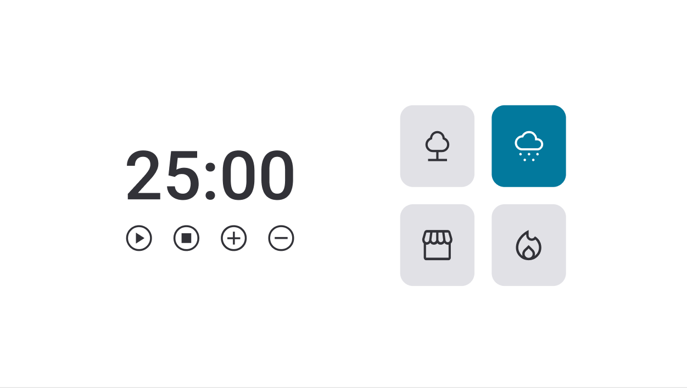

  

## 💻 Projeto  
Esse é um projeto Web de uma página que contém um timer para foco em estudos ou outras atividades. 
Existem várias funcionalidades designadas aos botões que controlam o contador, além da possibilidade de habilitar sons.

## 🚀 Tecnologias
Esse projeto foi desenvolvido durante o curso da Rocketseat com as seguintes tecnologias:

- HTML
- CSS
- JavaScript (módulos, sons, eventos, funções)

## 🏷️ Layout
Você pode visualizar o layout do projeto através [desse link](https://www.figma.com/file/BOFxjtCYI5OOAG15MIsfrL/Stage-05-Focus-Timer-2.0-Copy?fuid=1293008019758624272).
É necessário ter uma conta no [Figma](https://www.figma.com/).
